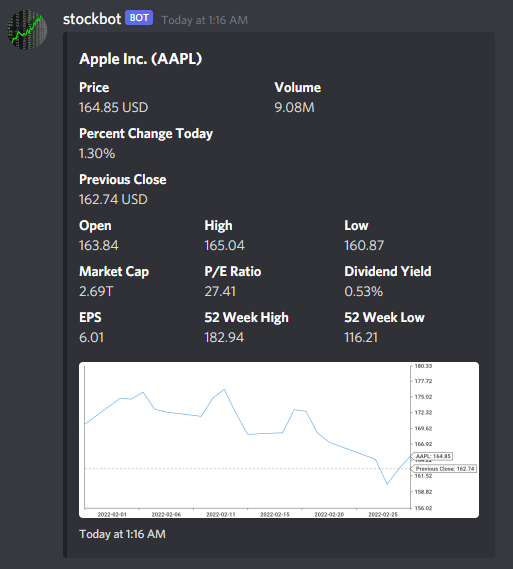

# Stockbot

If you want to just add the bot to your Discord server, use the following invite link:

https://discord.com/oauth2/authorize?client_id=943281411299880970&permissions=8&scope=bot

Note: this is self-hosted on Google Cloud by me and may be taken down at my discretion.

## Setup

Get your Discord bot token by creating a new application and bot through the [Discord Developer Portal](https://discord.com/developers/applications). 

Add the following to a .env file in the project root folder.
```
BOT_TOKEN=[YOUR BOT TOKEN]
```

Then serve this Discord bot locally by running `go run bot.go` on your local machine.

## Usage

Check if your bot is connected by running the command `!ping` in Discord.

Retrieve stock information by running `!get [symbol]`.

## Result

Running `!get AAPL` returns the following




